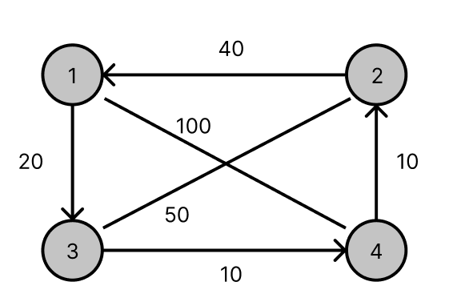

# Algoritmo Petrobras
Algoritmo do caixeiro viajante para solucionar a primeira fase da competicao Petrobras.

# A tarefa
A Tarefa a ser realizada pelo Robô Voador na FASE 1 é a seguinte:
O Robô deverá sair da base costeira, percorrer a arena e pousar 1 (uma) vez em cada
base existente, seja ela suspensa ou terrestre. Após isso, voltar para a base costeira.

# Condições
As bases suspensas são fixas. As basesterrestres terão suas posições conhecidas apenas
no momento da realização da tarefa. Elas serão posicionadas aleatoriamente na arena.
Um horário será definido para cada equipe realizar a FASE 1. Ao iniciar a FASE 1 e antes
das bases terrestres serem distribuídas aleatoriamente pela arena, todos os robôs
voadores deverão ser posicionados ao lado da base costeira e não poderão mais serem
programados ou ajustados pelas equipes.
Cada equipe terá 10 minutos corridos para realizar até 3 tentativas de cumprir as
tarefas. Será considerada a pontuação obtida na melhor das 3 tentativas, sendo as
demais descartadas.

# Explicações de Códigos
## construtivo.cpp

Código construtivo utilizando a Heurística do Vizinho mais próximo.
Nesta heurística, parte-se da cidade origem e adiciona-se a cada passo a cidade k
ainda não visitada cuja distância à última cidade visitada é a menor possível. O
procedimento de construção termina quando todas as cidades forem visitadas, situação
na qual é feita a ligação entre a última cidade visitada e a cidade origem.

